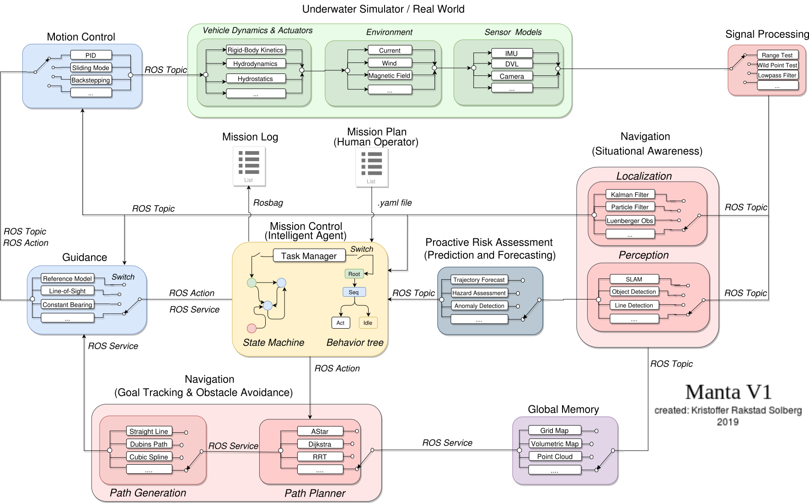
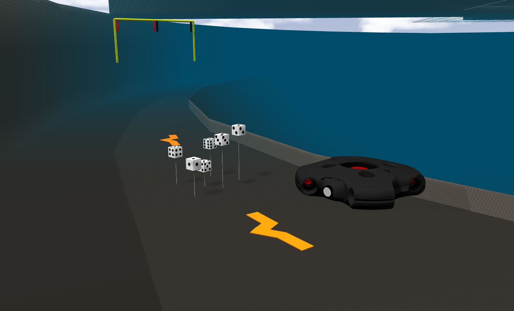
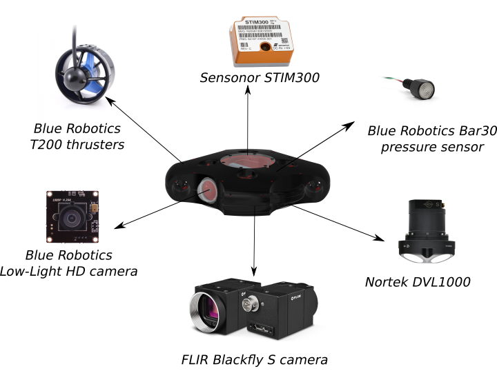
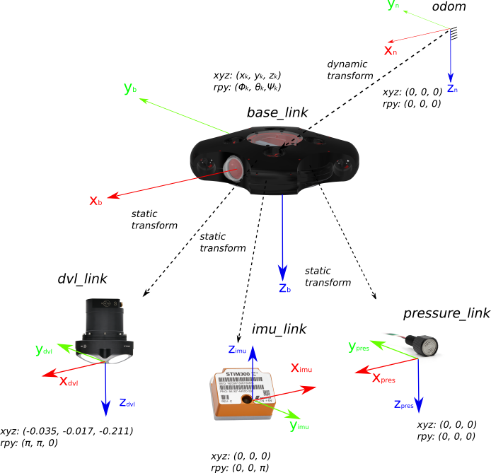

[](https://GitHub.com/vortexntnu/manta-auv/stargazers/)
[](https://GitHub.com/vortexntnu/manta-auv/watchers/)
[](https://GitHub.com/vortexntnu/manta-auv/network/)
## Manta AUV software - Vortex NTNU
[](http://vortexntnu.no)
[](https://GitHub.com/vortexntnu/manta-auv/releases/)

[](https://GitHub.com/vortexntnu/manta-auv/graphs/contributors/)
[](https://GitHub.com/vortexntnu/manta-auv/graphs/commit-activity)
[](https://GitHub.com/vortexntnu/manta-auv/pulls)
[](https://GitHub.com/vortexntnu/manta-auv/pulls)
[](https://opensource.org/licenses/MIT)




## Documentation
A Master's thesis explaining the project and features of the Manta software is found in the docs folder: https://github.com/vortexntnu/manta-auv/blob/master/docs/master_thesis_manta_v1_kristoffer_solberg_compressed.pdf

## Installation

### Prerequisites

Linux distributions Bionic (Ubuntu 18.04) <br />
C++ 11 compiler or newer.

### 1. Install ROS melodic for Ubuntu (If you do not have it already) ##

Follow the official guide at http://wiki.ros.org/melodic/Installation/Ubuntu

Robot operating system (ROS) provides services designed for heterogeneous computer cluster such as hardware abstraction, low-level device control, implementation of commonly used functionality, message-passing between processes, and package management. The main ROS client libraries (C++, Python, and Lisp) are geared toward a Unix-like system, primarily because of their dependence on large collections of open-source software dependencies.


### 2. Install the necessary dependencies to interface with drivers, Gazebo etc. ##
-------------------------

Quick command for installing all dependencies:  
```
sudo apt install protobuf-compiler ros-melodic-rosbridge-server ros-melodic-message-to-tf ros-melodic-geographic-msgs ros-melodic-move-base ros-melodic-move-base-msgs 
```

Explainations for the dependencies: 

1. Install the protobuf library, which is used as interface to Gazebo.:
	```bash
	 sudo apt-get install protobuf-compiler

2. Install rosbridge-server to interface with sensor and actuator drivers on the physical Manta.
	```bash
	 sudo apt-get install ros-melodic-rosbridge-server
  
3. Install tf. tf is a package that lets the user keep track of multiple coordinate frames over time:
	```bash
	 sudo apt-get install ros-melodic-message-to-tf

4. Install tf. tf is a package that lets the user keep track of multiple coordinate frames over time:
	```bash
	 sudo apt-get install ros-melodic-geographic-msgs

5. Install move-base-msgs. This is necessary to perform some actions:
	```bash
	 sudo apt-get install ros-melodic-move-base
	 sudo apt-get install ros-melodic-move-base-msgs 


### 3. Create a ROS workspace ##
-------------------------

1. creating a catkin workspace:
	```bash
	mkdir -p ~/manta_ws/src
	cd ~/manta_ws
	catkin_init_workspace
	```

2. building the workspace created:
	```bash
	cd ~/manta_ws/
	catkin build
	```

	Note: if you get the error message "catkin: command not found", run the following command:  

	```bash
	sudo apt-get install python-catkin-tools
	```
	
3. source the current workspace:
	```bash
	echo "source manta_ws/devel/setup.bash" >> ~/.bashrc
	```
	
4. close the current terminal.


### 3.1 Install ZED-ROS-Wrapper ##
-------------------------
[Official documentation](https://www.stereolabs.com/docs/ros/)

1. Download and install ZED SDK
    1. Download from [Stereolabs](https://www.stereolabs.com/developers/release/)
	2. Enter the directory with the file:
	```bash
	 cd path/to/download/folder
	```
	3. Make the file executable:
	```
	 chmod +x ZED_SDK_Ubuntu18_v3.0.run
	```
	4. Run the installer:
	```
	 ./ZED_SDK_Ubuntu18_v3.0.run
	```


2. Enter the catkin workspace:
	```bash
	 cd ~/manta_ws/src
	```

3. Clone the zed-ros-wrapper repo:
	```bash
	 git clone https://github.com/stereolabs/zed-ros-wrapper.git
	```

4. Jump up to parent directory:
	```bash
	 cd ../
	```

5. Install dependencies:
	```bash
	 rosdep install --from-paths src --ignore-src -r -y
	```

6. Build the package:
	```bash
	 catkin build
	```

7. Source the package:
	```bash
	 source ./devel/setup.bash
	```

### 4. Download and build Vortex AUV ##
-------------------------
1. Enter the folder where you want to clone the repostory:
	```bash
	 cd manta_ws/src
	```

2. Clone the repository: 
	```bash
	  git clone https://github.com/vortexntnu/Vortex-AUV.git
	  git clone https://github.com/vortexntnu/vortex_msgs.git
	```

Ps. Can also be manually download the zip-folder in the up-right corner and extract the file <br />
inside the src-folder of you workspace

3. Compile the code by running "catkin build" inside the workspace:
	```bash
	 cd ~/manta_ws/
	 catkin build vortex_msgs
	 catkin build
  
### 5. Download and build the customized UUV simulator ##
-------------------------



Figure by: Kristoffer Rakstad Solberg

1. Enter the folder where you want to clone the repostory:
	```bash
	 cd manta_ws/src
	```

2. Clone the repository: 
	```bash
	 git clone https://github.com/vortexntnu/Vortex-Simulator.git
	```

3. Clone the repository. WARNING: HIGH CPU LOAD, you might want to build packages separately the first time: 
	```bash
	 catkin build
	```
## Run Manta V1 in Simulation with Gazebo, Smach viewer, Camera pop-up windows etc ##
-------------------------

1. Run your simulation world. This will upload Manta (w/ sensor, camera, thrusters etc) and launch robot localization as well. i.e :
	```bash
	 roslaunch simulator_launch cybernetics_pool.launch
	```

2. Launch all modules required for operating Manta:
	```bash
	 roslaunch auv_setup auv.launch type:=simulator
	```

2. Execute your state machine of choice. i.e: 
	```bash
	 roslaunch finite_state_machine simtest.launch
	```

## Run Manta V1 in Linux minimal on your drone without Gazebo, Smach viewer, Camera pop-up windows etc ##



Figure by: Kristoffer Rakstad Solberg

1. The main computer for Manta AUV is a ODROID. Find the IP-address of the ODROID:
	```bash
	 nmap 10.42.0.1/24
	```
2. SSH into the ODROID:
	```bash
	 ssh root@10.42.*INSERT*
	```
3. Specify your static transforms and initial states in robot_localization/launch and robot_localization/params



Figure by: Kristoffer Rakstad Solberg

4. Run the robot localization for extended Kalman Filter for Aided Inertial Navigation:
	```bash
	 roslaunch robot_localization ekf_novembertest.launch
	```
5. ARM the thrusters (system specific). For the Manta AUV it will be:
	```bash
	 rostopic pub /mcu_arm std_msgs/String "data: 'arm'"
	```
6. Run your state machine of choice. This will activate all modules in Manta V1 architecture. i.e:
	```bash
	 roslaunch finite_state_machine odroid_sm
	```
7. DISARM the thrusters (system specific). For the Manta AUV it will be:
	```bash
	 rostopic pub /mcu_arm std_msgs/String "data: 'ben'"
	```

