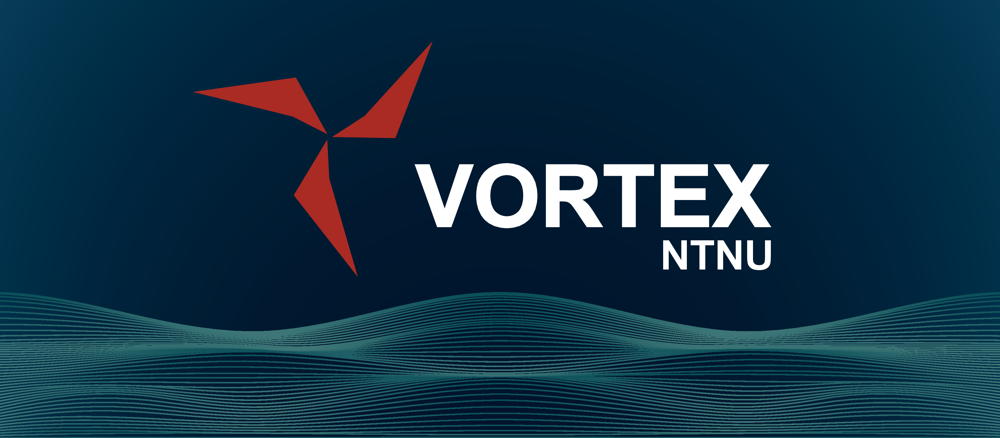

## Vortex AUV

This repo contains software for operating UUVs, developed by students at NTNU. The software is based on the ROS2 Humble framework, and aims to be hardware independent. Although the main focus of Vortex is autonomous operation, this software stack supports both AUV and ROV operations.

## Docker
We provide a Docker-based setup to simplify development and deployment. For full details (prerequisites, how to build and run, etc.), see the [Docker documentation](docker/README.md).

## Additional Repositories
This project requires additional repositories, which are listed in the [dependencies.repos](dependencies.repos) file, add these to your workspace.

## Documentation
* TODO: Drivers and hardware specifics for each drone will be added to the wiki. Link them here.
* TODO: How to adapt the software stack to new hardware.
* A collection of master theses written by Vortex members:
  *   [Manta v1: A Deliberative Agent Software Architecture for Autonomous Underwater Vehicles](https://github.com/vortexntnu/Vortex-AUV/blob/documentation/top-level_readme/docs/master_theses/Kristoffer%20Solberg%20(2020).pdf)
  *   [A real-time DVL and pressure sensor AINS comparison study between EKF, ESKF and NLO for Manta-2020](https://github.com/vortexntnu/Vortex-AUV/blob/documentation/top-level_readme/docs/master_theses/Oyvind%20Denvik%20(2020).pdf)
  *   [Sonar EKF-SLAM and mapping inanstructured underwater environment](https://github.com/vortexntnu/Vortex-AUV/blob/documentation/top-level_readme/docs/master_theses/Ambj%C3%B8rn%20Waldum%20(2020).pdf)
  *   [Autonomous Navigation, Mapping, and Exploration for Underwater Robots](https://github.com/vortexntnu/Vortex-AUV/blob/documentation/top-level_readme/docs/master_theses/V%C3%A5ge%2C%20Utbjoe%2C%20Gjerden%20og%20Engebretsen%20(2019).pdf)
