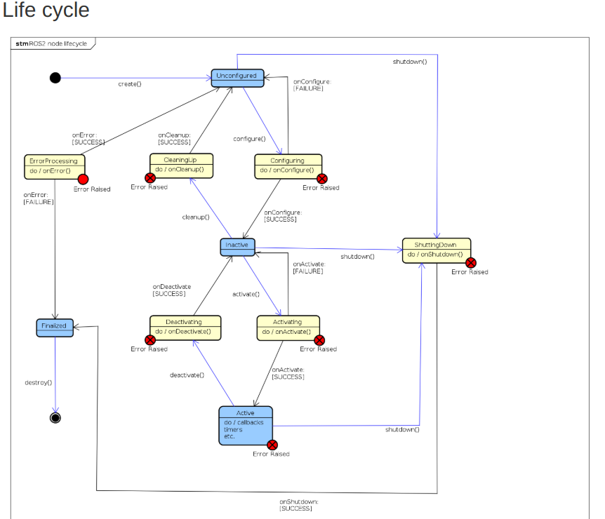

## Overview:
---
Contains the LQR controller package for the AUV Orca. The controller utilizes an LQR optimal controller (imported from the python control library), and controls pitch, yaw and surge. The controller is meant to traverse larger distances.

#### Tuning of Parameters:
 To tune parameters look at the [config file](https://github.com/vortexntnu/vortex-auv/blob/velocity-controller-to-lifecycle/control/velocity_controller_lqr/config/param_velocity_controller_lqr.yaml) file:


#### Launching the package:
1. Navigate to your ros2ws directory then (change your own path after cd or skip first line entirely),
```bash
cd ~/ros2ws/ &&
colcon build --packages-select velocity_controller_lqr &&
source install/setup.bash
```

2. Then simply run the node via the launch file
```bash
 ros2 launch velocity_controller_lqr velocity_controller_lqr.launch.py
```

3. You will notice that not much is currently happening, however that is because this is a lifecycle node and you can now transition between the node states through the terminal.

#### Transitioning between states manually:
The ROS2 node is implemented using lifecycle nodes, which are managed externally by a lifecycle manager i.e a finite state machine. If you want to manually test the node do the following:

**From Unconfigured ---> Inactive**
```bash
ros2 lifecycle set /velocity_controller_lqr_node configure
```

**From Configured ---> Active**
```bash
ros2 lifecycle set /velocity_controller_lqr_node activate
```

**From Active ---> Inactive**
```bash
ros2 lifecycle set /velocity_controller_lqr_node deactivate
```

For the full state diagram you can refer to the figure below, sourced from the official ROS2 Documentation:



### Theory
---
