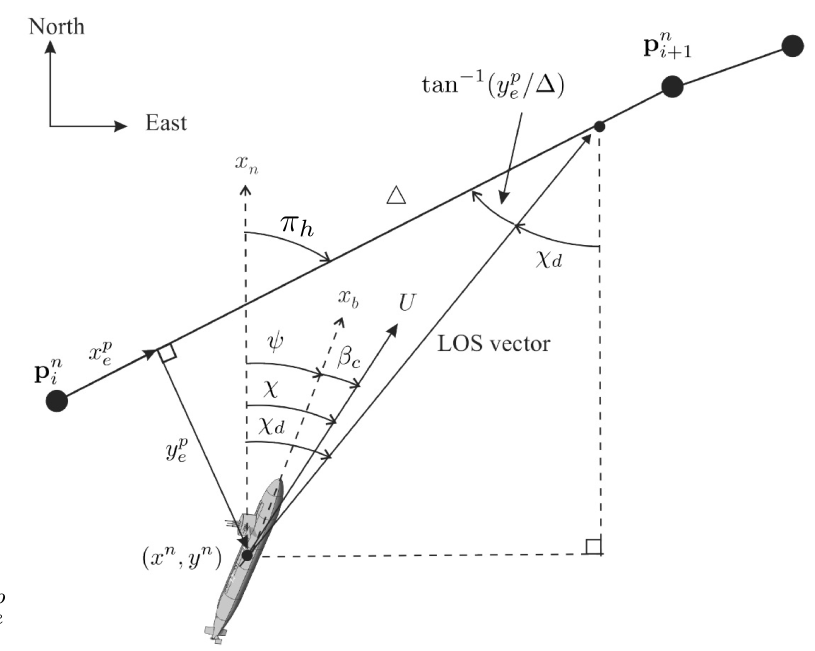

# LOS Guidance Action Server Implementation

A ROS2 implementation of a 3D Line-of-Sight (LOS) guidance for path following for autonomous underwater vehicles (AUVs).

## Overview

This package implements a **3D Line-of-Sight (LOS) guidance system** with adaptive parameter estimation and third-order filtering. The system calculates the desired heading (yaw), pitch, and surge velocity required for an AUV to follow a predefined path while minimizing cross-track errors. The package consists of two main components:

1. **LOS Guidance Algorithm** (`los_guidance_algorithm.py`) - Implements the core path-following logic.
2. **ROS2 Action Server** (`los_guidance_action_server.py`) - Provides a ROS2 interface for real-time guidance and control.

## Guidance Law Equations

The guidance system implements equations from *"Handbook of Marine Craft Hydrodynamics and Motion Control"* (Fossen, 2011).



The guidance law calculates the desired heading angle $\psi_d$ and desired pitch angle $\theta_d$. The crab angles $\beta_c$ and $\alpha_c$ are estimated adaptively. The guidance law is given as:

### Desired Heading and Pitch Angles

$$
\psi_d = \pi_h - \hat{\beta}_c - \tan^{-1}\left(\frac{y_e^p}{\Delta_h}\right)
$$

$$
\theta_d = \pi_v + \hat{\alpha}_c + \tan^{-1}\left(\frac{z_e^p}{\Delta_v}\right)
$$


### Adaptive Estimation of Crab Angles

$$
\dot{\hat{\beta}}_c = \gamma_h \frac{\Delta_h}{\sqrt{\Delta_h^2 + (y_e^p)^2}} y_e^p
$$

$$
\dot{\hat{\alpha}}_c = \gamma_v \frac{\Delta_v}{\sqrt{\Delta_v^2 + (z_e^p)^2}} z_e^p
$$

### Definitions

- $\Delta_h$ : Horizontal lookahead distance
- $\Delta_v$ : Vertical lookahead distance
- $\gamma_h, \gamma_v$ : Adaptive gains
- $y_e^p$ : Cross-track error
- $z_e^p$ : Vertical-track error

### Azimuth and Elevation Angles

The azimuth angle $\pi_h$ and the elevation angle $\pi_v$ are given by:

$$
\pi_h = \text{atan2}(y_{i+1}^n - y_i^n, x_{i+1}^n - x_i^n)
$$

$$
\pi_v = \text{atan2}(-(z_{i+1}^n - z_i^n), \sqrt{(x_{i+1}^n - x_i^n)^2 + (y_{i+1}^n - y_i^n)^2})
$$

where
- $P_i^n = (x_i^n, y_i^n, z_i^n)$ is the previous waypoint in the north-east-down (NED) frame.
- $P_{i+1}^n = (x_{i+1}^n, y_{i+1}^n, z_{i+1}^n)$ is the next waypoint in the NED frame.

### Path-Tangential Frame Errors

### Path-Tangential Reference Frame
The path-tangential coordinate system `{p}` has its origin at `(x_i, y_i, z_i)` with the `x_p`-axis pointing towards the next waypoint. The path-following errors are transformed using:

```math
\begin{bmatrix}
x_e^p \\
y_e^p \\
z_e^p
\end{bmatrix} =
\begin{bmatrix}
\cos(\pi_v) & 0 & \sin(\pi_v) \\
0 & 1 & 0 \\
-\sin(\pi_v) & 0 & \cos(\pi_v)
\end{bmatrix}
\begin{bmatrix}
\cos(\pi_h) & -\sin(\pi_h) & 0 \\
\sin(\pi_h) & \cos(\pi_h) & 0 \\
0 & 0 & 1
\end{bmatrix}
\begin{bmatrix}
x^n \\
y^n \\
z^n
\end{bmatrix}
```


The along-track, cross-track, and vertical-track errors in the path-tangential frame are computed as follows:

```math
\begin{bmatrix}
x_e^p \\ y_e^p \\ z_e^p
\end{bmatrix} = \mathbf{R}_{y, \pi_v}^\top \mathbf{R}_{z, \pi_h}^\top \left( \begin{bmatrix}
x^n \\ y^n \\ z^n
\end{bmatrix} - \begin{bmatrix}
x_i^n \\ y_i^n \\ z_i^n
\end{bmatrix}
\right)
```
where $P^n = (x^n, y^n, z^n)$ is the current position of the drone.

The **LOS Guidance Algorithm** is responsible for calculating the optimal control commands (surge speed, pitch, and yaw) to guide an AUV along a predefined path. It consists of:

#### Key Functionalities:
- **Distance-Based Velocity Control**: Adjusts speed based on distance to target.
- **Path-Following using LOS Guidance**: Computes desired heading and pitch angles.
- **Third-Order Reference Filtering**: Ensures smooth transitions in control commands.
- **Adaptive Sideslip Compensation**: Adjusts yaw to compensate for environmental disturbances (e.g., currents).

#### Key Classes:
- **`State`**: Represents the vehicle's state (position, orientation, velocity).
- **`LOSParameters`**: Stores configuration parameters for the LOS guidance behavior.
- **`FilterParameters`**: Holds parameters for the third-order filtering system.
- **`LOSGuidanceAlgorithm`**: The main class that computes guidance commands and applies filtering.

#### How It Works:
1. **Compute Raw Guidance Commands** (`compute_raw_los_guidance`)
   - Determines the heading (yaw), pitch, and velocity required to reach the target.
   - Uses the `ssa` (Smallest Signed Angle) function to normalize angles.

2. **Apply Reference Filtering** (`apply_reference_filter`)
   - Uses a third-order filter to smooth control commands before sending them to the vehicle.
   - Prevents abrupt changes in motion.

3. **Compute Final Guidance Commands** (`compute_guidance`)
   - Integrates raw guidance commands with filtering for a smooth and accurate trajectory.

### 2. ROS2 Action Server

The **ROS2 Action Server** (`los_guidance_action_server.py`) serves as the interface between the guidance algorithm and ROS2. It:

- Receives **waypoints** and **odometry data**.
- Calls the **LOS guidance algorithm** to compute control commands.
- Publishes the **guidance commands** to the appropriate ROS2 topics.

#### Key Features:
- **Waypoint Navigation**: Moves the AUV from one waypoint to the next.
- **ROS2 Parameter Handling**: Loads and manages parameters from `los_guidance_params.yaml`.
- **Odometry Processing**: Estimates the vehicle's current state for accurate navigation.
- **Real-Time Command Publishing**: Sends filtered control commands to ROS topics for execution.

## Parameters

Parameters for the guidance system are stored in **`los_guidance_params.yaml`**, including:

- **Lookahead Distances (`delta_h`, `delta_v`)**: Determines how far ahead the vehicle looks when computing guidance commands.
- **Adaptive Gains (`gamma_h`, `gamma_v`)**: Controls responsiveness to disturbances.
- **Speed Constraints (`nominal_speed`, `min_speed`)**: Defines the operating speed range.
- **Filter Settings (`omega_diag`, `zeta_diag`)**: Configures natural frequencies and damping ratios for smooth motion.
- **ROS2 Topics**: Specifies topic names for command publishing and debugging.

## ROS2 Topics

### **Published Topics**
| Topic Name | Type | Description |
|------------|------|-------------|
| `/guidance/los` | `State` | Guidance commands (surge, pitch, yaw) |
| `/guidance/debug/reference` | `State` | Reference tracking for debugging |
| `/guidance/debug/errors` | `State` | Error values for tuning |
| `/guidance/debug/logs` | `String` | Logs and diagnostics |

### **Subscribed Topics**
| Topic Name | Type | Description |
|------------|------|-------------|
| `/orca/odom` | `Odometry` | Vehicle odometry data |
| `/dvl/pose` | `Pose` | Position estimation |
| `/dvl/twist` | `Twist` | Velocity estimation |


## References
- *Fossen, T. I. (2011). Handbook of Marine Craft Hydrodynamics and Motion Control.*
- *Fossen, T. I. (2024). Slide 104: Guidance and Control for Marine Vehicles.*
